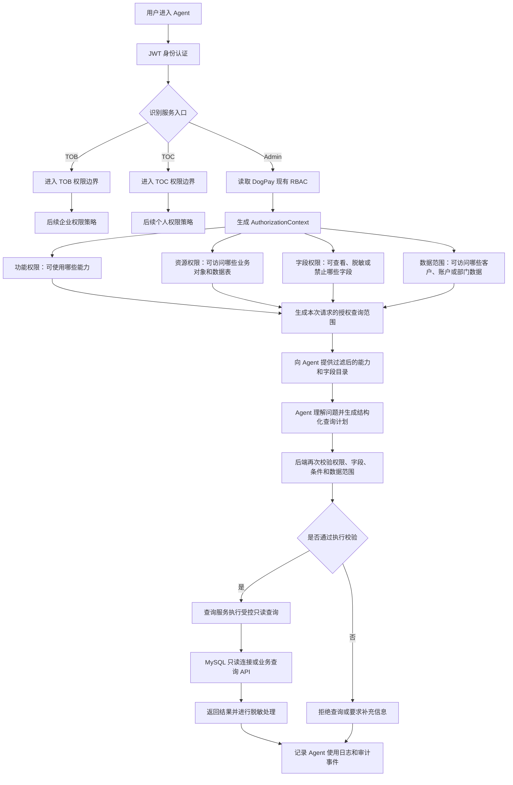
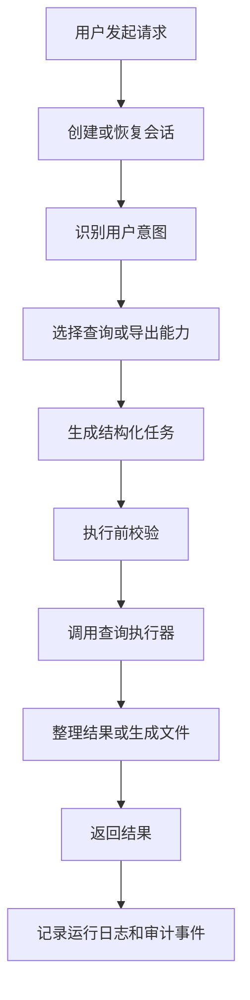

# DogPay Admin Agent 产品文档

> 文档状态：讨论稿
>
> 产品阶段：第一阶段，Admin 内部使用
>
> 项目位置：DogPay 后端仓库

## 1. 文档说明

本文档用于定义 DogPay Admin Agent 的产品定位、服务入口、权限边界、核心能力和分阶段建设范围，作为产品、后端、Agent Runtime、权限和测试工作的共同依据。

DogPay Admin Agent 的业务范围以 DogPay 后台管理、业务数据查询和内部操作审计为准。

## 2. 产品定位

DogPay Admin Agent 是建设在 DogPay 后端仓库中的智能业务代理模块，优先服务 DogPay Admin 后台内部人员。

Admin 用户可以通过自然语言查询其权限范围内的客户、账户、交易、余额、KYC、费率和操作日志等业务信息。Agent 必须先识别用户身份和权限，再决定能够访问哪些数据表、字段和数据范围，并对每一次查询进行完整留痕。

第一阶段以“受控查询”为核心，不直接开放调账、费率修改、审核或其他业务写操作。后续写操作必须经过结构化业务 API、用户确认、审批策略和完整审计。

### 2.1 Admin Agent 核心工作链路

Admin Agent 的核心原则是：权限由后端和查询服务强制执行，Agent 只负责在授权范围内理解问题和生成查询计划。即使 Agent 生成了未授权的表、字段或数据条件，执行层也必须拒绝查询。

## 3. 服务入口与用户边界

系统需要在请求进入 Agent 时识别三类服务入口：Admin、TOB 和 TOC。

| 服务入口 | 当前定位 | 第一阶段范围 | 权限来源 |
| --- | --- | --- | --- |
| Admin | DogPay 内部后台人员，第一优先级 | 权限识别、受控查询、日志查询、Agent 使用审计 | DogPay 后台现有 RBAC |
| TOB | 企业客户及其内部用户 | 建立入口识别，功能后续规划 | 后续企业权限体系 |
| TOC | 个人客户 | 建立入口识别，功能后续规划 | 后续个人权限体系 |

Admin、TOB、TOC 不是同一套权限下的用户，而是不同的服务入口和权限边界。当前产品优先完成 Admin Agent；TOB 和 TOC 先完成入口识别，并为后续开放功能预留清晰边界。

项目位置统一描述为“DogPay 后端仓库”，本阶段不在产品文档中约定具体仓库名称、目录结构或模块路径。

## 4. 身份认证与访问控制

本章是产品的重要基础章节，具体的 RBAC、数据表、字段和数据范围规则后续单独补充。

当前只确定以下原则：

- 请求进入 Agent 后，需要先识别用户身份和服务入口；
- 第一阶段接入 JWT，用于识别当前请求对应的用户和入口；
- Admin 用户复用 DogPay 后台现有 RBAC；
- Agent 当前只提供查询和导出能力，且全部为只读；
- Agent 不自行维护一套独立于 DogPay 后台的角色体系；
- 未完成访问控制校验时，不允许执行查询或导出。

## 5. Admin Agent 能力范围

### 5.1 当前能力

目前 Admin Agent 只提供两类业务能力：查询和导出，均不改变业务数据。

| 能力 | 支持内容 | 结果形式 |
| --- | --- | --- |
| 查询 | 列表、详情、看板、记录、日志、对账单 | 对话结果、结构化数据、统计结果 |
| 导出 | Excel、CSV、流水、账单、对账单 | 受控生成和下载文件 |

### 5.2 业务模块覆盖范围

功能清单中的 Admin 模块都可以作为查询和导出的业务来源，具体开放范围需要结合实际数据表、接口和 RBAC 配置逐步接入。

| 业务域 | 典型查询内容 |
| --- | --- |
| 首页、资产、会员 | 看板、资产明细、会员、订单和转化数据 |
| 客户与合规 | 客户资料、账户、KYC、KYB、CDD、AML 和风险记录 |
| 银行账户与 VA | VA 账户、对账单、入金、汇款单和交易记录 |
| 外汇系统 | 汇率、报价、询价、客户订单、渠道订单和收益 |
| 加密资产 | 钱包、充值、提现、交易和对账单 |
| 渠道与优享卡 | 渠道、卡片、持卡人、卡 KYC、卡交易和资金记录 |
| 收单与统一付款 | 商户、订单、付款、收款方、提现和异常订单 |
| 理财与财务中心 | 产品、持仓、收益、账单、发票、流水和资金池 |
| API、网站、eSIM、消息和系统工具 | API、Webhook、内容、订单、消息和系统记录 |

### 5.3 当前明确不支持

以下操作即使存在于 Admin 后台功能清单中，也不属于当前 Agent 能力：

- 审核、复核、驳回和风险评级；
- 开户、建户和业务提交；
- 费率、路由、渠道、标签、模板和策略配置；
- 调账、付款、提现和其他资金操作；
- 新增、编辑、删除和批量导入业务数据。

## 6. Admin Agent 使用场景

本章描述不同内部岗位使用 Agent 的典型查询和导出场景，暂不展开具体权限矩阵。

| 使用角色 | 典型任务 |
| --- | --- |
| 运营 | 查询客户、账户、产品、渠道和业务运营数据 |
| 客服 | 查询客户状态、交易记录、订单和处理记录 |
| 财务 | 查询余额、流水、账单、发票和对账单并导出 |
| 风控与合规 | 查询 KYC、KYB、AML、风险和审核记录 |
| 运维 | 查询 API、Webhook、系统和 Agent 使用日志 |
| 管理人员 | 查询业务看板、汇总数据和跨模块经营数据 |

## 7. Agent Runtime 总体设计

本章回答 Agent 如何接收请求、理解问题、选择能力、执行查询、生成结果和记录日志。

Runtime 的详细模块、状态、失败重试、超时、幂等和恢复机制后续补充。

## 8. 数据查询与导出架构

本章后续补充 MySQL 查询、业务 API 查询、数据库表字段信息、查询服务和导出服务的具体分工。

当前原则：

- Agent 不直接持有数据库连接和高权限凭证；
- 查询和导出都通过后端受控执行器完成；
- 数据库查询只读，不执行新增、修改和删除；
- 导出需要经过独立的导出校验和文件生成流程；
- 数据库查询和业务 API 查询需要统一返回结构，供 Agent 生成结果。

## 9. 沙箱使用策略

本章后续补充 SQL 校验、查询预检、只读限制和是否需要沙箱的判断。

当前原则：

- SQL 生成后的静态检查和安全预检可以使用受控沙箱；
- 真实查询使用受控的 MySQL 只读连接或查询 API；
- 沙箱不执行任何业务写操作；
- 第一阶段不开放通用 Python、Shell 或任意代码执行。

## 10. Agent 使用日志与审计

本章定义 Agent 查询和导出的留痕要求，包括用户、入口、请求、使用能力、查询对象、导出任务、执行状态和结果状态。

运行日志用于记录 Agent 如何运行；审计记录用于追踪用户实际查询和导出的业务行为。

## 11. 查询准确性与质量要求

本章后续定义表和字段选择准确率、查询结果正确性、时间范围理解、状态解释、导出数据一致性和回归测试要求。

## 12. 第一阶段 MVP

第一阶段目标是提供稳定、准确、可追溯的 Admin 只读 Agent。

| MVP 能力 | 要求 |
| --- | --- |
| 入口识别 | 支持识别 Admin、TOB、TOC |
| 身份认证 | 接入 JWT，识别用户和请求上下文 |
| Admin 查询 | 支持授权范围内的自然语言查询 |
| Admin 导出 | 支持授权范围内的数据导出 |
| 查询准确性 | 查询对象、字段、条件和结果基本正确 |
| 使用日志 | 可以查询 Agent 的调用记录 |
| 查询留痕 | Agent 查询和导出过程可追溯 |

## 13. 分阶段路线图

| 阶段 | 建设目标 |
| --- | --- |
| 阶段一 | Admin 入口、JWT、只读查询、只读导出、日志和审计 |
| 阶段二 | 完善功能清单中的业务模块、表字段和查询场景覆盖 |
| 阶段三 | 在权限、审批和业务 API 完整后，评估审核、配置和提交能力 |
| 阶段四 | 逐步开放 TOB、TOC 专属入口和功能 |

## 14. 用户故事与验收标准

本章后续补充 Admin 用户查询、导出、日志查询和异常场景的用户故事与验收标准。

## 15. 风险、依赖与待确认事项

本章后续记录 DogPay 后端接口、MySQL 结构、后台 RBAC、功能清单和真实业务字段之间的映射关系。

## 附录

- Admin 完整功能清单与 Agent 能力映射；
- 页面、业务对象、数据库表和查询 API 映射；
- 查询和导出任务示例；
- 业务术语和状态说明；
- Runtime、查询链路和审计流程图。
