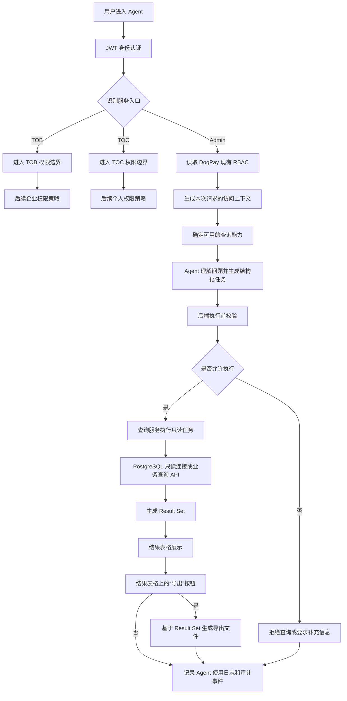
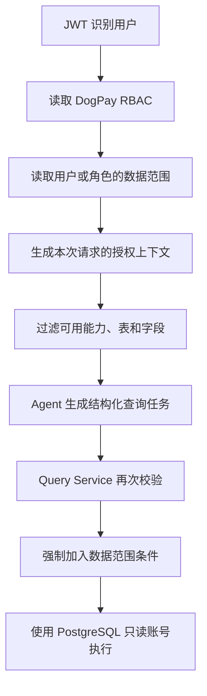
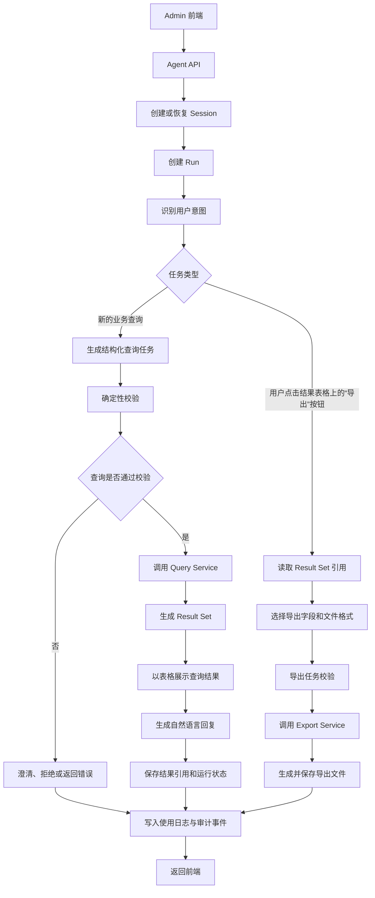
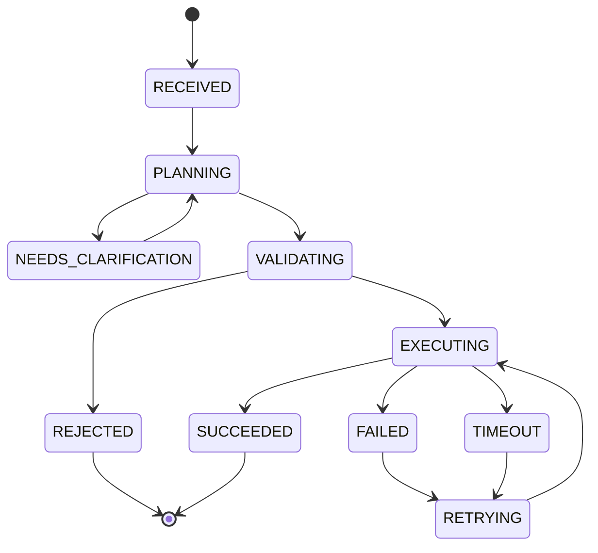
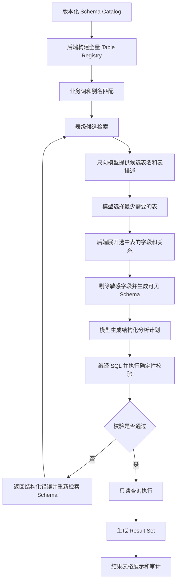
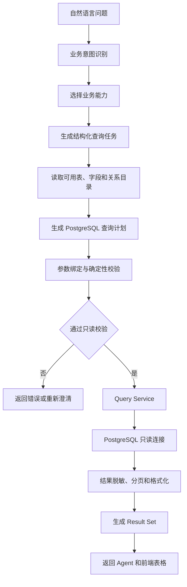
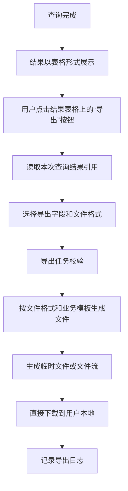
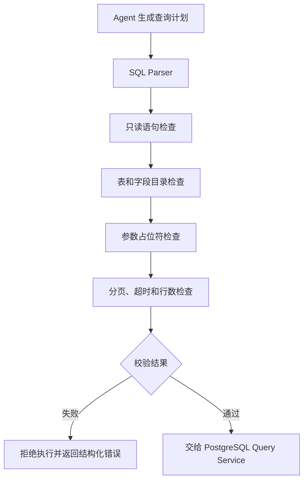
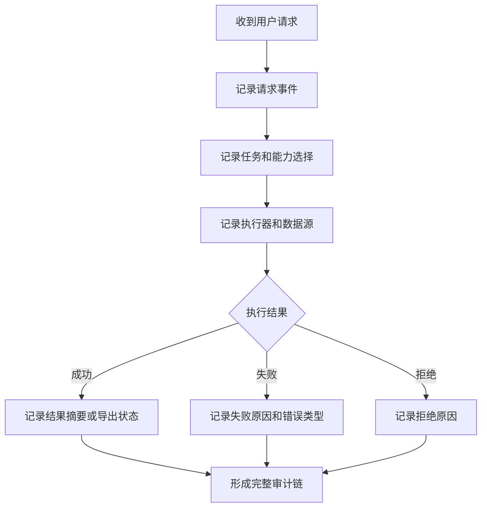

# DogPay Admin Agent 产品文档

> 文档状态：讨论稿
>
> 产品阶段：第一阶段，Admin 内部使用
>
> 项目位置：DogPay 后端仓库

## 1. 文档说明

本文档用于定义 DogPay Admin Agent 的产品定位、服务入口、权限边界、核心能力和分阶段建设范围，作为产品、后端、Agent Runtime、权限和测试工作的共同依据。

DogPay Admin Agent 的业务范围以 DogPay 后台管理、业务数据查询和内部操作审计为准。

## 2. 产品定位

DogPay Admin Agent 是建设在 DogPay 后端仓库中的智能业务代理模块，优先服务 DogPay Admin 后台内部人员。

Admin 用户可以通过自然语言查询其权限范围内的客户、账户、交易、余额、KYC、费率和操作日志等业务信息。Agent 必须先识别用户身份和权限，再决定能够访问哪些数据表、字段和数据范围，并对每一次查询和导出进行完整留痕。

第一阶段以“受控查询”为核心，不直接开放调账、费率修改、审核或其他业务写操作。后续写操作必须经过结构化业务 API、用户确认、审批策略和完整审计。

### 2.1 Admin Agent 核心工作链路



Admin Agent 的核心原则是：Agent 负责理解问题和生成任务，后端负责决定任务是否可以执行。权限和访问控制的详细设计统一放在第 4 章，不在产品流程中重复定义。

## 3. 服务入口与用户边界

系统需要在请求进入 Agent 时识别三类服务入口：Admin、TOB 和 TOC。

| 服务入口 | 当前定位 | 第一阶段范围 | 权限来源 |
| --- | --- | --- | --- |
| Admin | DogPay 内部后台人员，第一优先级 | 权限识别、受控查询、日志查询、Agent 使用审计 | DogPay 后台现有 RBAC |
| TOB | 企业客户及其内部用户 | 建立入口识别，功能后续规划 | 后续企业权限体系 |
| TOC | 个人客户 | 建立入口识别，功能后续规划 | 后续个人权限体系 |

Admin、TOB、TOC 不是同一套权限下的用户，而是不同的服务入口和权限边界。当前产品优先完成 Admin Agent；TOB 和 TOC 先完成入口识别，并为后续开放功能预留清晰边界。

项目位置统一描述为“DogPay 后端仓库”，本阶段不在产品文档中约定具体仓库名称、目录结构或模块路径。

## 4. 身份认证与访问控制

本章统一定义 Admin Agent 的访问控制基础，包括 DogPay 现有 RBAC、数据范围、Schema Catalog 和查询执行时的强制校验。具体角色编码、权限码和数据范围规则以 DogPay 后台现有实现为准，Agent 不重新维护一套角色体系。

当前只确定以下原则：

- 请求进入 Agent 后，需要先识别用户身份和服务入口；
- 第一阶段接入 JWT，用于识别当前请求对应的用户和入口；
- Admin 用户复用 DogPay 后台现有 RBAC；
- Agent 当前只提供查询和查询结果导出能力，且全部为只读；
- Agent 不自行维护一套独立于 DogPay 后台的角色体系；
- 未完成访问控制校验时，不允许执行查询或导出。

### 4.1 访问控制的三层范围

Agent 的可查询范围由三类信息共同决定：

```text
DogPay RBAC 功能权限
  + 用户或角色的数据范围
  + Agent Schema Catalog 的表、字段和敏感信息规则
  = 本次请求实际可查询的范围
```

| 控制层 | 解决的问题 | 示例 |
| --- | --- | --- |
| 功能权限 | 用户能不能使用某项 Agent 能力 | 是否允许查询客户、交易、KYC 或导出 |
| 数据范围 | 同一类数据中，用户能看到哪些记录 | BD1 可看客户 1、2，BD2 可看客户 3、4 |
| 表和字段范围 | 用户能访问哪些数据对象及字段 | 某岗位可查客户表，但不能查看证件号字段 |

Schema Catalog 负责描述表、字段、关系和业务含义；它本身不是权限系统。运行时需要先结合 RBAC 和数据范围过滤 Schema，再把当前用户实际可用的表和字段提供给 Agent。

### 4.2 推荐的权限执行方式

产品不假设现有 RBAC 一定已经实现了 PostgreSQL 层面的表级、字段级或行级控制，需要先确认 DogPay 后端的实际实现方式。

推荐将后端应用层作为主要权限执行层：



Agent 可以使用过滤后的权限信息进行规划，但不能自行决定权限，也不能删除后端强制加入的数据范围条件。PostgreSQL 的只读账号、只读库或查询视图作为基础安全边界；复杂的用户级数据范围仍应由后端查询服务统一执行。

### 4.3 当前需要确认的权限事实

需要从 DogPay 后端确认以下内容：

1. 现有 RBAC 是否只控制菜单、页面和接口，还是已经控制到数据库查询条件；
2. BD 等岗位的数据范围是通过客户归属、部门、组织还是其他关系计算；
3. 数据范围条件具体由哪一层注入 SQL 或查询请求；
4. 是否存在字段级权限、字段脱敏或敏感字段禁止返回；
5. Agent 的 Query Service 能否复用现有权限判断和数据范围实现。

## 5. Admin Agent 能力范围

### 5.1 当前能力

目前 Admin Agent 只提供两类业务能力：自然语言查询和查询结果表格导出，均不改变业务数据。

| 能力 | 支持内容 | 结果形式 |
| --- | --- | --- |
| 查询 | 列表、详情、看板、记录、日志、对账单 | 对话结果、结构化数据、统计结果 |
| 查询结果导出 | 将已完成查询结果表格导出为 CSV、Excel 等文件格式，并支持流水、账单、对账单等业务结果模板 | 基于本次查询结果生成和下载文件 |

### 5.2 业务模块覆盖范围

功能清单中的 21 个 Admin 模块全部进入 Agent 的产品能力范围，不做模块级删减。Agent 按页面、业务对象、数据源和查询口径逐步完成接入；逐步接入是研发交付顺序，不代表某些模块不属于产品范围。页面原有的“查”和“导出”操作会分别映射为查询能力和查询结果表格导出能力。

| 业务域 | 典型查询内容 |
| --- | --- |
| 首页、资产、会员 | 看板、资产明细、会员、订单和转化数据 |
| 客户与合规 | 客户资料、账户、KYC、KYB、CDD、AML 和风险记录 |
| 银行账户与 VA | VA 账户、对账单、入金、汇款单和交易记录 |
| 外汇系统 | 汇率、报价、询价、客户订单、渠道订单和收益 |
| 加密资产 | 钱包、充值、提现、交易和对账单 |
| 渠道与优享卡 | 渠道、卡片、持卡人、卡 KYC、卡交易和资金记录 |
| 收单与统一付款 | 商户、订单、付款、收款方、提现和异常订单 |
| 理财与财务中心 | 产品、持仓、收益、账单、发票、流水和资金池 |
| API、网站、eSIM、消息和系统工具 | API、Webhook、内容、订单、消息和系统记录 |

### 5.3 当前明确不支持

以下操作即使存在于 Admin 后台功能清单中，也不属于当前 Agent 能力：

- 审核、复核、驳回和风险评级；
- 开户、建户和业务提交；
- 费率、路由、渠道、标签、模板和策略配置；
- 调账、付款、提现和其他资金操作；
- 新增、编辑、删除和批量导入业务数据。

## 6. Admin Agent 使用场景

本章描述内部岗位如何使用 Agent 完成查询和导出，不在本章定义具体权限规则。

### 6.1 典型使用角色

| 使用角色 | 典型查询 | 典型导出 |
| --- | --- | --- |
| 运营 | 客户、账户、产品、渠道和业务运营数据 | 客户明细、活动记录和运营报表 |
| 客服 | 客户状态、交易记录、订单和处理记录 | 客户相关交易或订单记录 |
| 财务 | 余额、流水、账单、发票、收益和对账数据 | 流水、账单、发票和对账单 |
| 风控与合规 | KYC、KYB、CDD、AML、风险和持续识别记录 | 合规记录和风险相关明细 |
| 运维 | API、Webhook、消息和 Agent 使用日志 | 日志或接口记录 |
| 管理人员 | 业务看板、汇总数据和跨模块经营数据 | 管理报表和业务明细 |

### 6.2 典型对话任务

| 用户问题 | Agent 行为 | 输出 |
| --- | --- | --- |
| 查询某客户最近的交易记录 | 识别客户、交易和时间范围，执行只读查询 | 交易列表和汇总说明 |
| 查询某段时间内的入金金额 | 识别入金业务和统计口径，执行聚合查询 | 统计结果和数据时间范围 |
| 查询某批客户的账户明细后导出 | 先执行查询并展示结果表格，用户点击表格上的“导出”按钮 | 下载文件或任务状态 |
| 查询一次 Agent 调用记录 | 查询运行日志和审计事件 | 调用详情和执行状态 |
| 查询不明确的“订单” | 识别可能的业务域并要求澄清 | 澄清问题，不执行错误查询 |

### 6.3 使用原则

1. 用户使用自然语言描述业务问题，不需要了解数据库表名。
2. Agent 先确认业务对象、时间范围、统计口径和输出形式。
3. 查询结果需要说明数据来源、筛选条件和统计范围。
4. 查询完成后以表格展示结果；用户点击结果表格上的“导出”按钮后，系统按当前查询结果生成文件并返回下载状态。
5. 查询和导出都不能改变业务数据。

## 7. Agent Runtime 总体设计

Runtime 负责承接用户请求、编排 Agent、调用查询能力、生成结果并记录完整运行过程。Runtime 不直接向模型暴露数据库连接，也不允许模型自由构造后端请求。

### 7.1 Runtime 总体流程



### 7.2 Runtime 组件

| 组件 | 职责 | 不能承担的职责 |
| --- | --- | --- |
| Agent API | 接收请求、返回结果、提供流式状态 | 不执行 SQL，不直接连接 PostgreSQL |
| Session Manager | 保存会话、上下文和历史消息 | 不保存高敏感真实结果到普通上下文 |
| Run Manager | 管理一次任务的状态、重试和恢复 | 不把模型文本当作执行结果 |
| Capability Registry | 注册查询能力、结果导出操作及输入输出定义 | 不由模型临时创建能力 |
| Planner | 将自然语言转换为结构化查询任务，或识别已有 Result Set 的导出请求 | 不负责最终授权和执行 |
| Query Executor | 执行受控只读查询 | 不执行写 SQL |
| Export Service | 生成、存储和下载导出文件 | 不绕过查询校验直接导出全表 |
| Renderer | 将结构化结果转换为回复、表格和状态 | 不改变原始业务结果 |
| Audit Service | 记录运行过程和用户行为 | 不记录无法追溯的匿名操作 |

### 7.3 Run 生命周期



每个 Run 都需要有唯一标识，并保存任务类型、输入摘要、执行状态、错误信息、结果引用和时间信息。结果较大的查询和导出文件不直接塞入对话上下文，而是通过结果引用读取。

### 7.4 查询任务与结果导出

查询任务是 Admin Agent 的主要任务类型。查询完成后，系统生成一个 Result Set，并在结果区以表格形式展示。Result Set 表示本次查询经过校验后形成的结果集合，包含结果字段、查询条件、结果行数、数据来源、生成时间和结果引用。

前端默认每页展示 20 行，用户可以翻页查看同一查询条件下的后续结果。20 行是展示分页大小，不是查询结果上限。后端仍需要设置单次查询和单次导出的最大数据量，避免大范围查询影响 PostgreSQL 和 Agent 服务；这个上限与分页大小是两个不同的配置。

用户点击结果表格上的“导出”按钮后，系统基于当前查询条件、字段和授权范围生成文件，并直接下载到用户本地。导出不应因为分页而扩大数据范围，也不应绕过原查询的访问控制。

结果导出不是另一套独立的业务查询，也不能重新生成一条没有边界的全量 SQL。导出任务可以异步执行，但必须继承原查询的结果范围、数据口径和访问控制。用户没有可用的 Result Set 时，系统应要求用户先完成查询，不能直接执行“导出全部数据”。

结果区需要支持表格展示、分页、字段标题和空结果提示；结果卡需要保存 Result Set 引用。导出按钮、导出 API 和 CSV/Excel 文件生成服务属于 Admin Agent 的产品和工程建设范围。

### 7.5 Schema 的逐层进入方式

由于后台数据表数量较大，不能把全量表和字段一次性提供给 Agent。产品采用渐进式 Schema Disclosure，让 Agent 按当前任务逐层获取必要的表、字段和关系信息。



产品分层如下：

| 层级 | Agent 可以看到什么 | 产品设计 |
| --- | --- | --- |
| 全量元数据层 | 只由后端元数据服务持有完整表结构 | 保存版本化表、字段、类型和关系信息 |
| 表候选层 | 少量表名和表级业务描述 | 根据业务词、别名和表描述检索候选表 |
| 表选择层 | 候选表名和描述，不包含全量字段 | Agent 从候选表中选择完成任务所需的最少表集合 |
| 元数据展开层 | 已选表的字段、类型和关系 | 后端展开被选表的详细 Schema |
| 规划层 | 与任务相关的字段、关系、业务术语和查询能力 | Agent 生成结构化查询计划 |
| 执行校验层 | 已生成的查询计划和必要元数据 | 后端执行表、字段、参数和只读校验 |
| 执行层 | 查询结果或导出结果 | 通过受控查询服务返回结果 |

首轮表候选数量需要控制在较小范围内；查询规划失败时，可以扩大候选范围并重新规划。Agent 不能通过生成不存在的表名或字段名绕过这些阶段，后端需要在表选择、元数据展开和查询校验阶段分别检查。

## 8. 数据查询与导出架构

DogPay Admin Agent 的数据库查询数据源为 PostgreSQL。Agent 通过后端查询服务访问数据，不直接把 PostgreSQL 连接信息、账号或密码交给模型或前端。

### 8.1 查询链路



### 8.2 数据源选择

| 场景 | 推荐数据源 | 原因 |
| --- | --- | --- |
| 已有稳定的 Admin 查询接口 | DogPay 业务查询 API | 复用既有业务口径和参数校验 |
| 简单列表和详情查询 | 查询服务访问 PostgreSQL | 适合标准筛选和分页 |
| 跨模块统计、看板和对账 | 只读查询服务或专用查询视图 | 适合聚合、关联和报表计算 |
| 涉及业务状态机的查询 | 业务 API | 避免直接解释底层中间状态 |
| 查询结果导出 | Result Set + Export Service | 复用本次查询结果，统一字段、数据量和文件控制 |

数据库查询和业务 API 查询不是二选一。产品层统一成“查询能力”，由后端根据业务对象、数据口径和接口成熟度选择实际执行器；查询完成后统一生成 Result Set，供前端展示和后续导出。

### 8.3 Schema Catalog

Agent 需要一份可检索的数据目录，用于了解有哪些业务表、字段、关系和业务含义。该目录不是业务数据，也不是权限系统，而是查询规划所需的元数据。

产品需要把“结构事实”和“业务语义”分开保存，并在运行时按任务逐层披露。可以使用版本化文件、元数据服务或元数据表来承载这些信息，文件格式不是核心约束，分层进入规则才是核心设计。

建议由以下信息组成：

| 元数据来源 | 主要内容 |
| --- | --- |
| PostgreSQL `information_schema` | 表、字段、类型、索引、主键和注释 |
| 后端代码、实体和 Migration | 实际业务模型、枚举和字段变化 |
| 业务 API DTO 和接口定义 | 请求参数、返回字段和业务口径 |
| 业务配置 | 字段含义、别名、时间语义、状态解释和关联关系 |

目录需要支持版本化和同步，运行时只将与当前任务相关的目录信息提供给 Planner。具体的字段级权限、数据范围和角色映射归入第 4 章，不在本章重复定义。

### 8.4 DogPay PostgreSQL 元数据与查询要求

DogPay 使用 PostgreSQL，Schema Catalog 和查询服务需要以 PostgreSQL 的实际结构和语法为准。不能只根据页面名称或模型猜测字段，也不能把其他数据库的类型和 SQL 规则直接套用到 DogPay。

DogPay PostgreSQL 版本需要确定以下事实来源：

1. PostgreSQL `information_schema`；
2. DogPay 后端 ORM Entity、Migration 或建表脚本；
3. 已有业务查询 API 的请求和返回结构；
4. 人工维护的业务字段说明、状态枚举和表关联关系。

最终运行链路应使用 PostgreSQL 方言的类型归一化、SQL 编译和校验规则，并遵循先表级候选、再展开字段、最后生成和校验查询的分层方式。

### 8.5 PostgreSQL 只读要求

| 控制项 | 要求 |
| --- | --- |
| 数据库账号 | 使用独立只读账号或只读数据源 |
| SQL 类型 | 只允许查询语句，禁止新增、修改、删除和 DDL |
| 多语句 | 禁止一次请求执行多条 SQL |
| 字段范围 | 不允许默认使用 `SELECT *`，只选择任务需要的字段 |
| 参数处理 | 所有用户筛选值使用参数绑定 |
| 结果限制 | 强制分页、最大行数和最大导出量 |
| 查询资源 | 设置超时、并发和单任务资源上限 |
| 错误处理 | 对用户返回可理解的错误，不暴露数据库凭证和内部堆栈 |
| 记录 | 记录查询任务、SQL 指纹、耗时、行数和结果状态 |

### 8.6 查询结果表格导出流程

Result Set 是查询结果和导出之间的统一对象：

| 内容 | 说明 |
| --- | --- |
| `result_set_id` | 本次查询结果集合的唯一标识 |
| 查询条件 | 本次查询实际使用的业务条件和时间范围 |
| 字段定义 | 结果表格展示字段及其顺序 |
| 结果数据 | 经过查询校验后返回的结果集合 |
| 数据范围 | 本次查询实际覆盖的范围，不因导出扩大 |
| 数据来源 | PostgreSQL 查询服务或业务查询 API |
| 生成时间 | Result Set 生成的时间和数据时间口径 |
| 状态 | 可用、导出中、已导出、已过期或失败 |



导出对象默认是当前查询条件下的结果集合，而不是当前分页中正在显示的 20 条数据。若产品需要支持“仅导出当前页”，应作为单独的导出选项明确展示。若查询结果受到最大数据量限制，页面必须明确展示当前结果范围，导出也不能被描述为未受限制的全量数据。

导出文件直接下载到本地，不设置面向用户的长期文件保留策略。服务端如需临时生成文件，只保留完成本次下载所需的最短时间，并遵循后端现有临时文件清理规范。大数据量导出可以使用异步任务，前端通过任务 ID 查询生成状态。

导出字段默认跟随结果表格字段，也可以在导出前允许用户取消部分字段。无论字段如何选择，导出都不能增加原查询没有返回的数据范围。首期至少兼容 CSV 和 XLSX，其他常见表格格式通过 Export Service 扩展支持。

## 9. 沙箱使用策略

第一阶段不把整个 Agent 放进通用代码沙箱，也不开放 Python、Shell 或任意代码执行。沙箱和隔离 Worker 属于执行安全方案，是否采用具体实现取决于部署环境；无论是否使用沙箱，查询和导出都必须经过后端校验、只读限制和资源控制。

### 9.1 沙箱适用范围

| 场景 | 是否进入沙箱 | 说明 |
| --- | --- | --- |
| 自然语言理解 | 否 | 由 Runtime 调用模型服务完成 |
| SQL 语法和只读检查 | 是，推荐 | 在执行前检查语句类型和访问范围 |
| PostgreSQL 真实查询 | 否，使用独立查询执行器 | 通过受控只读连接执行 |
| 业务查询 API 调用 | 否，使用后端 API Client | 不让沙箱持有业务高权限凭证 |
| 导出文件生成 | 可使用隔离 Worker，作为方案建议 | 限制文件大小、内存和执行时间 |
| Python、Shell、任意代码 | 第一阶段不开放 | 避免扩大执行面和数据泄露面 |
| 业务写操作 | 禁止 | 当前产品没有写操作能力 |

### 9.2 SQL 校验边界



沙箱或校验器只能提供安全检查，不能替代后端最终执行控制。真实查询必须经过 Query Service；模型生成的 SQL 不能直接发送给 PostgreSQL。

### 9.3 是否需要沙箱的判断标准

当任务只是调用固定的查询 API 时，不需要沙箱。当任务包含模型生成的 SQL、复杂计算或文件转换时，使用受限的校验环境或隔离 Worker。无论是否使用沙箱，第一阶段都必须保持只读、限时、限量和可审计。

## 10. Agent 使用日志与审计

Agent 需要对查询和导出过程留痕。日志不仅用于排查系统问题，也用于确认“谁在什么时间，通过 Agent 查询或导出了什么内容”。

### 10.1 日志分类

| 类型 | 记录内容 | 主要用途 |
| --- | --- | --- |
| 运行日志 | Run 状态、阶段、耗时、错误和重试 | 定位 Agent 运行问题 |
| 查询日志 | 查询任务、数据源、SQL 指纹、行数和耗时 | 分析查询质量和性能 |
| 导出日志 | 结果引用、导出字段、格式、文件状态和下载记录 | 追踪查询结果导出行为 |
| 审计日志 | 用户、入口、操作类型、结果状态和时间 | 内部审计和责任追踪 |

### 10.2 最小记录字段

| 字段 | 说明 |
| --- | --- |
| `event_id` | 日志事件唯一 ID |
| `run_id` | 对应的 Agent 运行 ID |
| `session_id` | 对应的会话 ID |
| `user_id` | 发起请求的用户 |
| `audience` | Admin、TOB 或 TOC |
| `capability` | 使用的查询或导出能力 |
| `resource` | 业务对象或模块 |
| `request_summary` | 脱敏后的请求摘要 |
| `status` | 成功、失败、拒绝、超时或取消 |
| `result_set_id` | 对应的查询结果集合 |
| `row_count` | 返回或导出的数据量 |
| `export_format` | 导出文件格式，如 CSV 或 Excel |
| `export_fields` | 实际导出的字段列表 |
| `download_user_id` | 实际下载文件的用户 |
| `downloaded_at` | 文件下载时间 |
| `expires_at` | 结果或文件的过期时间 |
| `created_at` | 事件发生时间 |

原始敏感数据、完整结果集和数据库凭证不应写入普通日志。日志查询本身也属于只读能力，需要进入统一的 Agent 查询链路。

### 10.3 审计事件流程



## 11. 查询准确性与质量要求

Admin Agent 的第一阶段质量核心是“查得准、数据一致、过程可追溯”，而不是对话表现得复杂。

### 11.1 质量指标

| 指标 | 关注内容 |
| --- | --- |
| 意图识别准确性 | 能否识别查询对象、查询动作和用户目标 |
| 业务模块选择准确性 | 能否选对客户、VA、付款、卡、财务等业务域 |
| 表和字段选择准确性 | 能否使用正确的表、字段和关联关系 |
| 条件准确性 | 时间、状态、币种、金额和客户筛选是否正确 |
| 结果正确性 | Agent 结果是否与 PostgreSQL 或业务 API 真实结果一致 |
| 导出一致性 | 导出内容是否与确认的查询条件和字段一致 |
| 可解释性 | 是否说明数据口径、时间范围和结果状态 |
| 稳定性 | 超时、失败、重试和连续追问是否可恢复 |

### 11.2 查询质量保障

1. 建立覆盖客户、账户、交易、KYC、VA、付款和财务等业务域的标准问题集。
2. 为每个标准问题保存期望业务对象、筛选条件、字段和结果校验方式。
3. 通过 Schema Catalog 限制模型可选择的表和字段。
4. 通过确定性校验阻止错误 SQL、缺失条件和超范围结果。
5. 将真实问题中出现的别名、状态和时间表达沉淀为业务词典。
6. 每次表结构或业务接口变化后执行回归测试。

### 11.3 查询失败处理

| 失败类型 | Agent 行为 |
| --- | --- |
| 业务对象不明确 | 询问用户选择具体业务对象 |
| 时间范围不明确 | 要求补充时间范围或采用明确的默认口径并展示 |
| 字段不存在 | 不猜字段，重新选择目录或返回无法查询 |
| 查询条件不足 | 说明缺少的条件 |
| SQL 校验失败 | 不执行，返回可理解的原因 |
| 数据源超时 | 返回任务状态，支持查询或重试 |
| 无数据 | 明确说明在当前条件下没有结果 |

## 12. 第一阶段 MVP

第一阶段目标是提供稳定、准确、可追溯的 Admin 只读 Agent。业务能力只有自然语言查询和查询结果表格导出，不包含任何写入或状态变更。

### 12.1 MVP 范围

| MVP 能力 | 要求 | 状态 |
| --- | --- | --- |
| 入口识别 | 支持识别 Admin、TOB、TOC | 第一阶段 |
| 身份接入 | 接入 JWT，识别用户和请求上下文 | 第一阶段 |
| Admin 查询 | 支持已接入页面的自然语言查询，并以结构化结果表格展示 | 第一阶段按页面逐步接入 |
| Result Set | 保存查询结果、字段、条件、数据范围和结果引用 | 第一阶段 |
| Admin 查询结果导出 | 用户点击结果表格上的“导出”按钮，按当前 Result Set 导出 | 第一阶段按页面逐步接入 |
| 查询执行 | 使用 PostgreSQL 只读连接或业务查询 API | 第一阶段 |
| 查询日志 | 可以查询 Agent 的调用记录 | 第一阶段 |
| 查询与导出留痕 | 查询、Result Set、导出和下载过程可追溯 | 第一阶段 |
| 运行恢复 | 支持 Run 状态、失败反馈和基本重试 | 第一阶段 |

### 12.2 MVP 不包含

- 审核、复核、驳回和风险评级；
- 开户、建户和业务提交；
- 费率、路由、渠道、标签、模板和策略配置；
- 调账、付款、提现和其他资金操作；
- 新增、编辑、删除和批量导入业务数据；
- 通用 Python、Shell 或任意代码执行。

### 12.3 MVP 接入原则

功能清单中的全部模块进入产品能力规划，但具体接入按照页面逐步推进。一个页面只有同时满足“数据源可用、查询口径明确、字段目录完整、接口稳定、可测试”时，才可以进入可用范围。第一批接入页面需要在功能清单映射表中单独标记，不能将整个模块默认视为已上线。

## 13. 分阶段路线图

| 阶段 | 建设目标 | 主要产出 |
| --- | --- | --- |
| 阶段一：只读基础 | Admin 入口、JWT、只读查询、结果表格、Result Set、结果导出、日志和审计 | 可用的 Admin 只读 Agent |
| 阶段二：模块覆盖 | 按页面接入功能清单中的重点业务域 | 业务能力目录、页面映射、查询回归集和结果导出能力 |
| 阶段三：质量提升 | 提升准确率、稳定性、性能和数据口径一致性 | 标准问题集、监控、质量报告 |
| 阶段四：业务操作评估 | 在权限、业务 API、确认和审批具备后评估写操作 | 独立的操作型 Agent 方案 |
| 阶段五：对客入口 | 逐步开放 TOB、TOC 的独立能力和产品体验 | 面向企业和个人的独立能力边界 |

阶段四不代表自动开放写操作。任何写操作都需要独立评审，不应因为查询 MVP 已上线而默认继承查询权限和执行方式。

## 14. 用户故事与验收标准

### 14.1 用户故事

| 编号 | 用户故事 | 验收结果 |
| --- | --- | --- |
| US-01 | 作为 Admin，我希望用自然语言查询客户信息 | 返回与数据源一致的客户结果，并显示查询口径 |
| US-02 | 作为 Admin，我希望查询某客户的交易记录 | 支持筛选、分页、汇总和连续追问 |
| US-03 | 作为 Admin，我希望点击结果表格上的“导出”按钮 | 基于当前 Result Set 导出，字段、条件和结果与当前查询一致，不重新扩大查询范围 |
| US-04 | 作为 Admin，我希望查询 Agent 使用日志 | 可以按时间、用户、任务和状态查询调用记录 |
| US-05 | 作为 Admin，我的问题不明确时 | Agent 应先澄清，不执行猜测性查询 |
| US-06 | 作为运维人员，我希望知道任务失败原因 | 返回可理解的错误类型，并保留运行日志 |
| US-07 | 作为系统管理员，我希望查询和导出可追溯 | 每次任务都有 Run ID 和审计事件 |

### 14.2 核心验收标准

| 场景 | 验收标准 |
| --- | --- |
| 正常查询 | 能完成已接入业务域的列表、详情和统计查询 |
| 正常导出 | 用户点击结果表格上的“导出”按钮，系统基于当前 Result Set 生成约定格式文件，并直接下载或返回生成状态 |
| 查询准确 | 表、字段、筛选条件和结果与预期口径一致 |
| 数据一致 | 结果与 PostgreSQL 或业务 API 在同一查询时点保持一致 |
| 只读保证 | 任何查询和导出请求都不能修改业务数据 |
| 异常处理 | 数据源异常、超时、无数据和参数缺失均有明确反馈 |
| 日志留痕 | 请求、能力、执行状态和结果状态可查询 |
| 会话恢复 | 刷新或重新打开会话后能够恢复查询任务、Result Set 和结果引用 |

## 15. 风险、依赖与待确认事项

### 15.1 主要依赖

| 依赖项 | 需要确认的内容 |
| --- | --- |
| DogPay 后端 | Agent 模块接入方式、服务边界和部署方式 |
| PostgreSQL | 数据库版本、只读连接、查询库和数据量 |
| 业务 API | 可复用的查询接口、参数和返回结构 |
| 功能清单 | 页面、业务对象和实际接口的对应关系 |
| Schema Catalog | 表字段、业务含义、状态和关系的维护方式 |
| 现有 RBAC | 入口识别和后续访问控制的集成方式 |
| 日志系统 | 存储位置、保留周期、检索方式和脱敏要求 |

### 15.2 主要风险

- 后台页面名称与实际业务实体、数据库表名称不一致，导致 Agent 选择错误。
- 同一个业务对象在不同渠道有不同字段、状态和处理流程。
- PostgreSQL 表结构缺少业务注释，单靠字段名无法保证查询准确性。
- 大查询和大文件导出影响数据库和服务稳定性。
- 日志记录过多真实数据，造成敏感信息泄露风险。
- 业务接口、表结构或状态枚举变化后，Agent 目录没有及时同步。
- 只读查询结果不能直接代表业务最终状态，需要明确数据口径和更新时间。

### 15.3 待确认事项

以下事项已经确认，不再作为产品待确认项：

- 当前暂无稳定的模块查询 API，首期以模块筛选式查询为主要接入方式；
- PostgreSQL 存在可申请的只读账号，具体账号由测试环境提供；
- 21 个 Admin 模块全部纳入 Agent 产品范围，不做模块级删减；
- 首期导出需要兼容 CSV、XLSX 等常见表格格式；
- 导出文件直接下载到用户本地，不设计长期文件保留。

仍需确认的事项：

1. 功能清单中的页面分别对应哪些业务对象、PostgreSQL 表和字段；
2. Agent 使用日志是否直接沿用 DogPay 后端现有日志存储和查询方式；
3. Schema Catalog、RBAC 和数据范围的具体实现方式，统一在第 4 章确认；
4. 单次查询和单次导出的最大数据量如何设置；
5. 导出首期是否按当前查询条件导出全部结果，还是同时支持“仅导出当前页”；
6. CSV、XLSX 之外是否还需要首期支持其他固定格式或业务模板。

## 附录 A：Admin 功能清单与 Agent 能力映射

当前 Agent 对功能清单的统一映射只有两类业务能力。页面原有的其他操作保留在规划范围内，但不进入第一阶段 Agent 执行范围：

| 页面操作 | Agent 能力 | 当前阶段 |
| --- | --- | --- |
| 查 | 查询能力，并生成 Result Set 和结果表格 | 第一阶段按页面逐步接入 |
| 导出 | 对已生成 Result Set 的查询结果表格导出 | 第一阶段按页面逐步接入 |
| 审、开户、配置、提交、导入 | 暂不提供 Agent 执行能力 | 后续独立评估 |

### A.1 业务模块范围

| 编号 | Admin 模块 | 功能清单原始操作 | Agent 第一阶段映射 |
| --- | --- | --- | --- |
| 1 | 首页 | 查 | 看板和汇总数据查询；不单独产生导出能力 |
| 2 | 资产管理 | 查、导出、导入 | 资产、转化和收益查询；原页面支持导出的结果支持导出 |
| 3 | 会员管理 | 查、导出、配置 | 会员、级别、订单和名单查询；原页面支持导出的结果支持导出 |
| 4 | 客户管理 | 查、导出、审、配置 | 客户、账户、KYC、KYB、AML、标签和邀请返佣查询；原页面支持导出的结果支持导出 |
| 5 | 营销中心 | 查、导出、配置 | 活动、优惠券、Banner 和奖励记录查询；原页面支持导出的结果支持导出 |
| 6 | APP 管理 | 查、配置 | 版本、审核配置、账号和 Hub 数据查询 |
| 7 | 银行账户（VA） | 查、导出、审、开户、提交、配置 | VA 账户、对账单、交易、汇款单和开户记录查询；原页面支持导出的结果支持导出 |
| 8 | 外汇系统 | 查、导出、审、配置 | 渠道、货币对、汇率、报价、订单和收益查询；原页面支持导出的结果支持导出 |
| 9 | 加密资产 | 查、导出、审 | 钱包、地址、充值、提现、交易和对账单查询；原页面支持导出的结果支持导出 |
| 10 | 渠道管理 | 查、导出、配置 | 客资和签署记录查询；原页面支持导出的结果支持导出 |
| 11 | 优享卡 | 查、导出、审、开户、配置、提交 | 资金、卡、KYC、开户和交易查询；原页面支持导出的结果支持导出 |
| 12 | 收单业务管理 | 查、导出、审、配置 | 商户、订单、提现和异常订单查询；原页面支持导出的结果支持导出 |
| 13 | 统一付款 | 查、导出、审 | 付款、收款方和付款记录查询；原页面支持导出的结果支持导出 |
| 14 | 理财管理 | 查、导出、配置 | 产品、持仓、收益账户和收益记录查询；原页面支持导出的结果支持导出 |
| 15 | 财务中心 | 查、导出、审、提交、配置 | 资金池、账单、发票、收入、流水和调账记录查询；原页面支持导出的结果支持导出 |
| 16 | API 管理 | 查、配置 | API 客户和 Webhook 记录查询 |
| 17 | 网站管理 | 查、配置 | 博客、标签和帮助中心内容查询 |
| 18 | eSIM 管理 | 查、导出、配置 | eSIM 订单和产品查询；原页面支持导出的结果支持导出 |
| 19 | 消息中心 | 查、导出、配置、提交 | 模板、站内信、邮件和 Topic 记录查询；原页面支持导出的结果支持导出 |
| 20 | 系统工具 | 查、配置 | 表单模板和系统记录查询 |
| 21 | 权限管理 | 查、配置 | 用户、部门、角色和权限配置查询；具体访问边界由第 4 章后续定义 |

### A.2 页面级映射示例

以下示例说明功能清单中的页面如何转换成 Agent 能力。示例不是对第一批上线页面的承诺；页面是否进入第一阶段，以数据源、字段目录、查询口径和测试结果为准。

| 模块 | 页面 | 原始操作 | Agent 能力映射 | 结果导出 |
| --- | --- | --- | --- | --- |
| 客户管理 | 客户列表 | 查、导出 | 客户列表查询、结果表格展示 | 支持 |
| 客户管理 | 客户详情 | 查、配置 | 客户详情查询 | 不支持独立导出 |
| 客户管理 | KYC 列表 | 查、审 | KYC 状态和记录查询 | 不支持独立导出 |
| 客户管理 | AML 日志列表 | 查、导出 | AML 日志查询、结果表格展示 | 支持 |
| 银行账户（VA） | 银行账户对账单 | 查、导出 | VA 对账单查询、结果表格展示 | 支持 |
| 银行账户（VA） | VA 开户列表 | 查、审、开户 | VA 开户记录查询 | 不支持独立导出 |
| 外汇系统 | 对客询价记录 | 查、导出 | 询价记录查询、结果表格展示 | 支持 |
| 加密资产 | 充值列表 | 查、审、导出 | 充值记录查询、结果表格展示 | 支持 |
| 统一付款 | 付款列表 | 查、审、导出 | 付款记录查询、结果表格展示 | 支持 |
| 财务中心 | 流水查询 / 导出 | 查、导出 | 财务流水查询、结果表格展示 | 支持 |
| API 管理 | Webhook 列表 | 查、配置 | Webhook 记录查询 | 不支持独立导出 |
| 权限管理 | 用户管理 | 查、配置 | 用户和角色关联信息查询 | 不支持独立导出 |

### A.3 页面映射要求

每个准备接入 Agent 的页面，至少需要补充以下映射信息：

| 映射项 | 说明 |
| --- | --- |
| 页面名称 | Admin 页面名称和路由 |
| 业务对象 | 客户、账户、交易、订单、卡或其他对象 |
| 查询能力码 | Agent 使用的稳定能力标识 |
| 数据来源 | 业务 API、PostgreSQL 表或查询视图 |
| 可查询字段 | 页面展示和 Agent 可返回的字段 |
| 筛选条件 | 状态、时间、客户、币种和金额等条件 |
| 导出字段 | 查询结果表格中的默认字段和可选字段 |
| 状态说明 | 状态值和业务含义 |
| 测试样例 | 典型问题、期望查询和结果校验 |

## 附录 B：术语

| 术语 | 定义 |
| --- | --- |
| Admin Agent | 面向 DogPay 后台内部人员的只读业务 Agent |
| Runtime | 负责会话、任务编排、执行和状态管理的运行时 |
| Query Service | 负责执行受控查询的后端服务 |
| Export Service | 负责生成、保存和下载导出文件的服务 |
| Run | 一次 Agent 请求从接收至结束的完整运行实例 |
| Session | 用户与 Agent 连续交互的会话容器 |
| Schema Catalog | 供 Agent 查询规划使用的表、字段和业务元数据目录 |
| 只读 | 只允许查询和导出，不改变业务数据 |
